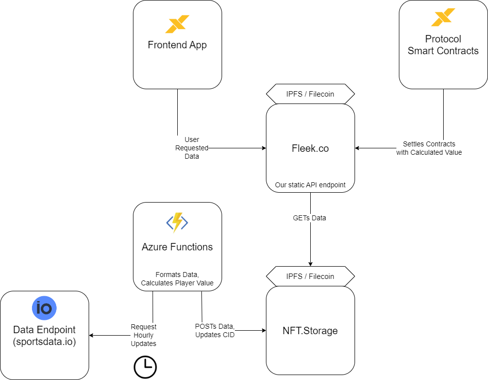

# Athlete-X IPFS Implementation

### Directory

- [Technology Stack](#technology-stack)
    - [IPFS](#ipfs)
    - [Filecoin](#filecoin)
    - [NFT.Storage](#nftstorage)
    - [Fleek.co](#fleekco)
    - [Azure Functions](#azure-functions)
- [Implementation](#implementation)
- [Adding New Markets](#adding-new-markets)
    - [sports-cids](#sports-cids)
    - [IPFS-API](#ipfs-api)
    - [fleek-api](#fleek-api)

## Technology Stack

### IPFS

[IPFS](https://ipfs.tech/), ***InterPlanetary File System***, is a peer-to-peer network and protocol designed to create a distributed and decentralized method for storing and sharing files and data on the internet. It is based on a content-addressable, versioned filesystem, and uses cryptographic hash functions to ensure the integrity and authenticity of the data. IPFS enables faster, more efficient, and more resilient distribution of files and data, while also reducing the dependency on centralized servers and improving overall security and privacy.

### Filecoin

[Filecoin](https://filecoin.io/) is a sister protocol of [IPFS](#IPFS).
It is a decentralized storage network and cryptocurrency that enables users to store, retrieve, and share data in a secure, efficient, and decentralized manner. It is based on a proof-of-storage consensus mechanism, where storage providers compete to provide the most reliable and cost-effective storage solutions. Users can purchase storage space with the Filecoin cryptocurrency and storage providers are incentivized with rewards in Filecoin for providing storage services. Filecoin aims to create a more decentralized, secure, and efficient storage solution that is not controlled by a single entity or organization.

### NFT.Storage

[NFT.Storage](https://nft.storage/) is a decentralized file storage and hosting service that is specifically designed for storing and serving non-fungible tokens (NFTs) on the Ethereum blockchain. NFT.storage provides a simple and secure way to store NFT data off-chain, while still keeping the ownership and authenticity of the NFT on-chain. It uses IPFS to store the NFT data in a decentralized manner. This ensures that the data is always available and cannot be tampered with or lost. NFT.storage offers an easy-to-use API that developers can integrate into their NFT applications. This API allows developers to upload, store, and retrieve NFT data using a simple and standardized interface. The service is designed to be scalable, so it can handle large volumes of data and traffic.

### Fleek.co

[Fleek.co](https://fleek.co/) is a decentralized platform for building, hosting, and deploying websites and web applications. It provides a simple and user-friendly interface for developers and content creators to easily create and manage their decentralized web projects.
One of the key features of Fleek.co is its seamless integration with IPFS, which allows users to store their website files and data on a decentralized network, ensuring that their content is always available and cannot be tampered with or lost. Fleek.co also offers a content delivery network (CDN) to ensure fast and reliable delivery of website content to users.

### Azure Functions

[Azure Functions](https://azure.microsoft.com/en-us/products/functions/) is a serverless computing service provided by Microsoft Azure that enables developers to build and run event-driven applications and functions in the cloud. It allows developers to write code in a variety of programming languages, including C#, Java, JavaScript, and Python, and execute that code in response to various triggers, such as HTTP requests, queue messages, or timer events. With Azure Functions, developers can create lightweight, scalable, and cost-effective applications without having to worry about managing infrastructure, as the service automatically provisions and scales resources based on demand.

----

## Implementation

We use a Timer Triggered *Azure Function* that calls to our API endpoint on a recurring basis.
Only the specific athletes of a market are gathered, defined by their player-id in the corrosponding [sports-cids](https://github.com/AthleteX-DAO/sports-cids) market file, with label list. This is a CID to a file on the Filecoin network that stores the Athlete's ID's.
Within the funciton, the necessairy data for each athlete is collected, such as thier name, team, and statistics.
Using those statistics, the player's value is calculated using the market formula.
Each athlete defined by our list is then added to a file directory and sent to NFT.Storage to be storaed on Filecoin.

All data on Filecoin is public, so anyone with the CID of the files are able to view the contents.
The tricky part is that the files change CIDs due to us uploading and deleting files with each Azure Function execution.
That is why with each execution, the Azure Funcitons writes to repo [sports-cids](https://github.com/AthleteX-DAO/sports-cids) and updates that markets current CID.

To have a constant address, we have created an API Endpoint on Fleek.co. Fleek is currently moving to Fleek.xyz as a Web3 app, but until then, we are utilizing their complete Web2 interface. Fleek hosts our static website that routes requests from Filecoin to users. A users is able to route using the following syntax:

> /#/sport

> /#/sport/id

> /#/sport/id_history

> /#/sport/ALL_PLAYERS

For example: */#/NFL/18882_history*

To see currently available sports, go to the base route (and you will alos be able to see the current CIDs that are being requests to fetch the data).

Currently, the api is hosted here at [icy-sun-3786.on.fleek.co](https://icy-sun-3786.on.fleek.co/), but this should be placed within the AthleteX domain soon.

----

## Adding New Markets

Complete the following steps in the [AthleteX-DAO](https://github.com/AthleteX-DAO) orginization repos in GitHub.

### [sports-cids](https://github.com/AthleteX-DAO/sports-cids)

1. In NFT.Storage, use the AthleteX account to create a new API Key for the market
2. Create a new json file that maps "athletes" to the list of Athlete IDs used
    1. See the [NFL example](https://bafkreienw53gzof2e6ry6bdjl42comqybpzjxkljzmj4sgrudgu2dwjtvq.ipfs.nftstorage.link/)
3. Create a new file in [sports-cids](https://github.com/AthleteX-DAO/sports-cids) for the new market
    1. Also create a json with the fields "list" and "directory"
    2. The "list" field should be set to the CID of the file you just created in NFT.Storage
    3. The "directory" field should be set to "null"

### [IPFS-API](https://github.com/AthleteX-DAO/IPFS-API)

4. Next, we will be creating the Azure Function
5. Start by creating a new Funciton in VS Code using the extension
    1. For standardized naming, name it $MARKET_Function (for example: NFL_Funciton)
    2. The Funciton should be Timer Triggered
    3. The CronJob schedule should be set to: `0 0 */1 * * *`
        1. This will run the job on the hour, every hour
6. Copy over the the following files:
    1. `NFT_Storage_Requests.js`
    2. `SPORTSDATA_Requests.js`
7. In Azure, add the new Secret Key: "STORAGE-$MARKET-PROD" (example: "STORAGE-NFT-PROD")
    1. The value of the key is the API key from NFT.Storage
8. Collect the needed Athletes and Statistics from Sportsdata and calculate each formula
9. Use the `updatePriceList` method in NFT_Storage_Requests.js to send the files to NFT.Storage
10. Setup automated actions so that pushes to main updates Azure

### [fleek-api](https://github.com/AthleteX-DAO/fleek-api)

11. You will be working here: [fleek-api](https://github.com/AthleteX-DAO/fleek-api)'s file `App.js`
    1. Request the CIDs from [sports-cids](https://github.com/AthleteX-DAO/sports-cids)
    2. Create 2 new routes:
        1. "/${MARKET}"
        2. "/${MARKET}/:id"
    3. You should be able to use `GETContent` for the list item
    4. You should be able to use `GETSubContent` for the directory item
    5. Update `Home` so that it displays when it is loading the market and the CIDs of the two files